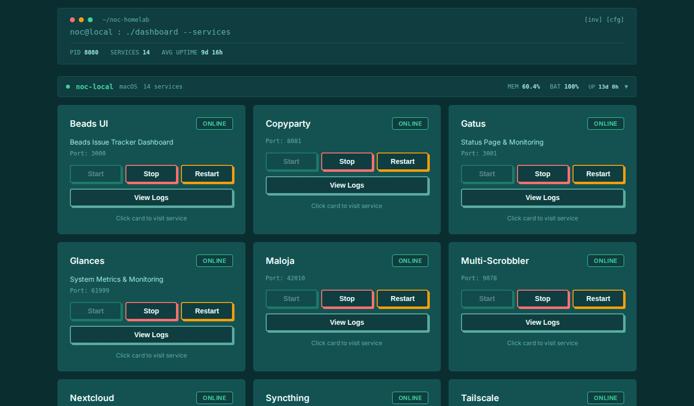

[](LICENSE)
# noc-homelab

A four-machine homelab running macOS, Linux, and a VPS, connected over Tailscale. Manages media streaming, Matrix communications, game streaming, and monitoring through a central dashboard and agent API.



---

## Machines

| Machine | OS | Role | Connectivity |
|---|---|---|---|
| **noc-local** | macOS | Dashboard host, sole writable git clone, Cloudflare tunnels | LAN + Tailscale |
| **noc-tux** | Ubuntu 24.04 LTS | Agent, media pipeline, Matrix, observability stack | LAN + Tailscale `100.91.104.124` |
| **noc-claw** | macOS | On-device LLM runtime (MLX), log-triage | Tailscale `100.95.102.128` |
| **noc-baguette** | AlmaLinux 9 | OVH VPS, rathole tunnel server | Public + Tailscale `100.96.57.116` |

## Architecture

```
noc-local (macOS)                          noc-tux (Ubuntu)
┌──────────────────────┐                   ┌──────────────────────┐
│  Dashboard :8080     │◄── Agent API ───► │  Agent :8080         │
│  Copyparty / Maloja  │    (Tailscale)    │  Matrix Stack        │
│  TeamSpeak 6         │                   │  Media Pipeline      │
│  Caddy / Beads UI    │                   │    (Zurg → Rclone →  │
│  Cloudflare tunnels  │                   │     FileBot → Emby)  │
│  Syncthing (hub)     │                   │  Sunshine            │
│                      │                   │  Loki / Grafana      │
└──────────────────────┘                   │  CrowdSec LAPI       │
           ▲                               │  Rathole Client ─────┼──► noc-baguette
           │ Agent API                     └──────────────────────┘         │
           ▼                                          ▲                     │
┌──────────────────────┐                              │ Syncthing           │
│  noc-claw (macOS)    │──────────────────────────────┘                     ▼
│  MLX Server :8181    │                              ┌──────────────────────┐
│  log-triage :8182    │                              │  noc-baguette (VPS)  │
└──────────────────────┘                              │  Rathole Server      │
                                                      │   :2333 (Tailscale)  │
                                                      │   :23512/udp public  │
                                                      └──────────────────────┘
```

The dashboard on noc-local polls the agent API on noc-tux and noc-claw for live service status. Service control (start/stop/restart) is forwarded through the agents, which manage systemd units, LaunchAgents, and Docker containers.

File sync is hub-and-spoke: noc-local is the only writable git clone, and Syncthing distributes the working tree to the two spokes. Edits made on a host propagate back to noc-local for commit. See `noc-homelab-beads/memory/syncthing_workflow.md` for operational detail.

## Services

### noc-local

| Service | Port | Manager | Description |
|---|---|---|---|
| Dashboard | 8080 | launchd | Central control plane |
| Copyparty | 8081 | launchd | File server with web UI |
| Maloja | 42010 | launchd | Music scrobble server |
| Multi-Scrobbler | 9078 | launchd | Scrobbler aggregator |
| TeamSpeak 6 | 9987 | Docker | Voice chat + screen share |
| Syncthing | 8384 | launchd | File sync hub |
| Caddy | 80/443 | launchd | Reverse proxy |
| Beads UI | 3000 | launchd | Issue tracker dashboard |
| Forgejo | 3090 | launchd | Self-hosted Git forge (git.nocfa.net) |
| Glances / Netdata | 61999 / 19999 | launchd | System metrics |
| CrowdSec Agent | -- | launchd | Forwards alerts to noc-tux LAPI |
| Cloudflare tunnels | -- | launchd | All public-facing edge endpoints |

### noc-tux

| Service | Port | Manager | Description |
|---|---|---|---|
| Agent | 8080 | systemd (user) | Service control API |
| Matrix Synapse + Element + Admin | -- | systemd | matrix.nocfa.net + element.nocfa.net |
| Matrix Traefik / Postgres / Coturn | 443 / -- / 3478 | systemd | Reverse proxy + DB + TURN |
| Emby / Plex | 8096 / 32400 | systemd | Media streaming |
| Zurg + Rclone | 9999 / -- | systemd (user) | Real-Debrid WebDAV → FUSE at `/mnt/zurg` |
| Sunshine | 47990 | systemd (user) | Game streaming (HEVC/AV1) |
| Gatus / Glances / Netdata | 3001 / 61999 / 19999 | systemd | Health + metrics |
| Loki + Grafana | 3100 / 3000 | Docker | Log aggregation, 14-day retention |
| Alloy | -- | systemd | Log shipper → Loki |
| CrowdSec LAPI | 8150 | systemd | Central alerting (3 agents) |
| Arcane | 3552 | Docker | Docker management UI |

### noc-claw

| Service | Port | Manager | Description |
|---|---|---|---|
| MLX Server | 8181 | launchd | `mlx_lm.server` serving `mlx-community/gemma-3-12b-it-4bit` |
| log-triage | 8182 | launchd | MLX-backed CrowdSec alert enricher |
| Glances / Netdata | 61999 / 19999 | launchd | System metrics |
| CrowdSec Agent | -- | launchd | Forwards alerts to noc-tux LAPI |

### noc-baguette

| Service | Port | Manager | Description |
|---|---|---|---|
| Rathole Server | 2333/tcp | systemd | Tunnel control (Tailscale-only) |
| Forgejo SSH | 2222/tcp | rathole | git-only SSH (ssh.git.nocfa.net) |
| Resonite | 23512/udp | rathole | Resonite headless server tunnel |
| Attack-surface scanner | -- | systemd timer | Weekly nuclei + testssl + ssh-audit |

## Media Pipeline

```
Real-Debrid Cloud
       │ (API poll every 10s)
       ▼
Zurg (WebDAV :9999) ──► Rclone FUSE (/mnt/zurg)
       │
       ▼ on_library_update hook
library-update.sh
  ├── FileBot: movies → media/movies/
  ├── FileBot: shows  → media/shows/
  ├── Emby /Library/Refresh
  └── Plex /library/sections/all/refresh
       │
       ▼
Emby (8096) + Plex (32400)
```

Content stays in the Real-Debrid cloud — no local storage needed. A `zurg-healthcheck` timer runs every 5 minutes comparing the Real-Debrid API torrent count against what Zurg is serving and restarts the stack on divergence.

## Matrix Stack

Self-hosted Matrix homeserver at `matrix.nocfa.net`, Element Web at `element.nocfa.net`. All six services run as native systemd units (no Docker). Traefik handles TLS, Coturn handles TURN/STUN. Admin UI at `matrix.nocfa.net/synapse-admin/`.

## Rathole Tunnels

Game servers run on noc-tux behind NAT. [Rathole](https://github.com/rapiz1/rathole) punches outbound through the NAT to noc-baguette, exposing UDP/TCP ports publicly without opening the home router. The control channel (port 2333) is Tailscale-only — the VPS is not a jump box.

## Observability & Security

- **Logs** — Loki on noc-tux ingests from all hosts via Grafana Alloy. 14-day retention, "Homelab Logs" dashboard provisioned in Grafana.
- **Metrics** — Netdata parent on noc-tux streams from brew-installed children on both Macs. 4GB dbengine retention.
- **IDS** — CrowdSec LAPI on noc-tux (Tailscale + LAN only). Both Macs run native v1.7.7 agents in agent-only mode. Alerts fan out via a direct Discord webhook and an MLX-backed log-triage enricher on noc-claw. Currently observation mode (decisions stored, nothing blocked).
- **External attack surface** — weekly nuclei + testssl + ssh-audit run on noc-baguette, results to Discord on findings.

## Secrets Management

[git-crypt](https://github.com/AGWA/git-crypt) — transparent clean/smudge filter encryption. Plaintext on disk for direct service use; ciphertext in git objects. Patterns listed in `.gitattributes` (25 files: `configs/*.env`, `services/*/.env`, etc.). [gitleaks](https://github.com/gitleaks/gitleaks) runs in the pre-commit hook as a defense-in-depth scan.

The git-crypt key lives in a separate private sync repo (`noc-homelab-beads/`, gitignored here). Fresh-clone procedure: `git clone <url> && cd noc-homelab && git-crypt unlock /path/to/git-crypt.key`.

## Git Framework

- **noc-local is the only writable clone.** Three remotes: `origin` (self-hosted Forgejo), `codeberg`, and `github`. A push hits all three.
- **Hosts (noc-tux, noc-claw) have no `.git/`.** They receive working-tree updates via Syncthing and cannot commit. Edits made on a host propagate back to noc-local.
- **Pre-commit hook** runs the beads workflow guard followed by gitleaks against staged content. A leaked secret aborts the commit.
- **GPG-signed commits** on all three machines.

## Repository Structure

```
noc-homelab/
├── agent/                  REST API agent (canonical multi-host config)
│   ├── agent.py            Flask app, port 8080 (Linux) / 5005 (macOS)
│   ├── config.yaml         All hosts; agent filters by platform.node()
│   └── platforms/          Linux/macOS/Windows handlers
├── dashboard/              Control dashboard (runs on noc-local)
├── linux/                  Systemd units, scripts, native service configs
├── services/               Docker Compose stacks + per-service configs
├── configs/                Per-host service configs (most git-crypt-encrypted)
├── launchagents/           macOS LaunchAgent plists
├── scripts/                Utility scripts
├── setup/                  Per-machine bootstrap scripts
└── docs/                   Architecture and setup notes
```

## Deployment

```bash
git clone ssh://git@codeberg.org/noc/noc-homelab.git
cd noc-homelab
git-crypt unlock /path/to/git-crypt.key
./setup/setup-linux.sh   # noc-tux
# or
./setup/setup-macos.sh   # noc-local / noc-claw
```

Setup scripts install dependencies, wire up the pre-commit hook, configure GPG signing, and lay down the systemd / launchd units relevant to the host.
